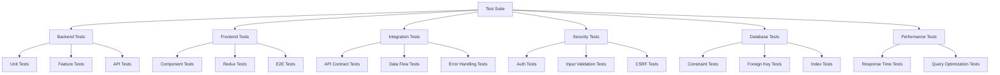

# Design Document: Lovecraftian Escape Room - Complete Test Suite

## Overview

This design specifies a comprehensive testing architecture for the Lovecraftian Escape Room application, addressing the critical issue where users successfully authenticate but puzzles fail to load. The test suite spans backend (Laravel/PHPUnit), frontend (React/Vitest), API integration, security, database integrity, and performance testing. The architecture ensures end-to-end validation of the login-to-puzzle flow and prevents regression of the identified issue.

## Architecture



## Project Structure

```
lovecraftian-escape-room/
├── tests/
│   ├── Backend/
│   │   ├── Unit/
│   │   │   ├── Models/
│   │   │   │   ├── UserTest.php
│   │   │   │   ├── SessionTest.php
│   │   │   │   ├── PuzzleTest.php
│   │   │   │   └── RankingTest.php
│   │   │   └── Services/
│   │   │       ├── AuthServiceTest.php
│   │   │       ├── SessionServiceTest.php
│   │   │       └── PuzzleServiceTest.php
│   │   ├── Feature/
│   │   │   ├── Auth/
│   │   │   │   ├── RegisterTest.php
│   │   │   │   ├── LoginTest.php
│   │   │   │   └── LogoutTest.php
│   │   │   ├── Sessions/
│   │   │   │   ├── CreateSessionTest.php
│   │   │   │   ├── GetSessionsTest.php
│   │   │   │   └── SyncSessionTest.php
│   │   │   ├── Puzzles/
│   │   │   │   ├── GetCurrentPuzzleTest.php
│   │   │   │   ├── SubmitSolutionTest.php
│   │   │   │   └── GetHintTest.php
│   │   │   └── Rankings/
│   │   │       ├── GetTopRankingsTest.php
│   │   │       └── GetUserRankTest.php
│   │   └── Database/
│   │       ├── IntegrityTest.php
│   │       ├── ConstraintsTest.php
│   │       └── IndexesTest.php
│   ├── Frontend/
│   │   ├── Unit/
│   │   │   ├── Components/
│   │   │   │   ├── LoginForm.test.tsx
│   │   │   │   ├── PuzzleDisplay.test.tsx
│   │   │   │   ├── ProgressBar.test.tsx
│   │   │   │   └── Leaderboard.test.tsx
│   │   │   └── Utils/
│   │   │       ├── apiClient.test.ts
│   │   │       └── validators.test.ts
│   │   ├── Integration/
│   │   │   ├── Redux/
│   │   │   │   ├── authSlice.test.ts
│   │   │   │   ├── sessionSlice.test.ts
│   │   │   │   └── puzzleSlice.test.ts
│   │   │   └── Flows/
│   │   │       ├── loginFlow.test.tsx
│   │   │       └── puzzleFlow.test.tsx
│   │   └── E2E/
│   │       ├── loginToPuzzle.test.ts
│   │       ├── puzzleSolving.test.ts
│   │       └── leaderboard.test.ts
│   ├── Integration/
│   │   ├── LoginPuzzleFlow.test.ts
│   │   ├── APIContract.test.ts
│   │   └── DataRoundTrip.test.ts
│   ├── Security/
│   │   ├── AuthenticationTests.php
│   │   ├── InputValidationTests.php
│   │   └── CSRFProtectionTests.php
│   ├── Database/
│   │   ├── ForeignKeyTests.php
│   │   ├── ConstraintTests.php
│   │   └── IndexTests.php
│   └── Performance/
│       ├── APIResponseTimeTests.php
│       └── QueryOptimizationTests.php
├── phpunit.xml
├── vitest.config.ts
└── playwright.config.ts
```

## Backend Testing (Laravel/PHPUnit)

### Configuration

**phpunit.xml**:
```xml
<?xml version="1.0" encoding="UTF-8"?>
<phpunit xmlns:xsi="http://www.w3.org/2001/XMLSchema-instance"
         xsi:noNamespaceSchemaLocation="https://schema.phpunit.de/9.5/phpunit.xsd"
         bootstrap="tests/bootstrap.php"
         cacheResultFile=".phpunit.cache/test-results"
         executionOrder="depends,defects"
         forceCoversAfterClassToOnlyMethods="false"
         beStrictAboutCoverageMetadata="false"
         beStrictAboutOutputDuringTests="true"
         beStrictAboutTestsThatDoNotTestAnything="true"
         beStrictAboutTodoTestedCode="true"
         failOnRisky="true"
         failOnWarning="true"
         verbose="true">
    <testsuites>
        <testsuite name="Unit">
            <directory suffix="Test.php">tests/Backend/Unit</directory>
        </testsuite>
        <testsuite name="Feature">
            <directory suffix="Test.php">tests/Backend/Feature</directory>
        </testsuite>
        <testsuite name="Database">
            <directory suffix="Test.php">tests/Backend/Database</directory>
        </testsuite>
        <testsuite name="Security">
            <directory suffix="Test.php">tests/Security</directory>
        </testsuite>
        <testsuite name="Performance">
            <directory suffix="Test.php">tests/Performance</directory>
        </testsuite>
    </testsuites>
    <coverage processUncoveredFiles="true">
        <include>
            <directory suffix=".php">app</directory>
        </include>
        <exclude>
            <directory>app/Console</directory>
            <directory>app/Http/Middleware</directory>
        </exclude>
    </coverage>
</phpunit>
```

### Key Backend Tests

#### Test 1: Session Creation with Puzzle Initialization

```php
// tests/Backend/Feature/Sessions/CreateSessionTest.php
namespace Tests\Feature\Sessions;

use Tests\TestCase;
use App\Models\User;
use App\Models\Game;
use App\Models\Session;
use App\Models\Puzzle;

class CreateSessionTest extends TestCase
{
    protected User $user;
    protected Game $game;

    protected function setUp(): void
    {
        parent::setUp();
        $this->user = User::factory()->create();
        $this->game = Game::factory()->create();
    }

    /**
     * Test that session creation initializes first puzzle
     * Addresses: Requirement 6 (Game Session Creation)
     * Addresses: Requirement 29 (Puzzle Loading Issue Detection)
     */
    public function test_session_creation_initializes_first_puzzle(): void
    {
        $response = $this->actingAs($this->user)
            ->postJson('/api/sessions', [
                'game_id' => $this->game->id,
            ]);

        $response->assertStatus(201);
        $response->assertJsonStructure([
            'data' => [
                'session_id',
                'current_puzzle_id',
                'remaining_time',
                'status',
            ],
        ]);

        $sessionId = $response->json('data.session_id');
        $puzzleId = $response->json('data.current_puzzle_id');

        // Verify session exists
        $session = Session::find($sessionId);
        $this->assertNotNull($session);
        $this->assertEquals('active', $session->status);
        $this->assertNotNull($session->started_at);

        // Verify first puzzle is initialized
        $this->assertNotNull($puzzleId);
        $puzzle = Puzzle::find($puzzleId);
        $this->assertNotNull($puzzle);
        $this->assertEquals($session->id, $puzzle->session_id);
    }

    /**
     * Test that puzzle data is complete and valid
     * Addresses: Requirement 29 (Puzzle Loading Issue Detection)
     */
    public function test_puzzle_data_is_complete_and_valid(): void
    {
        $response = $this->actingAs($this->user)
            ->postJson('/api/sessions', [
                'game_id' => $this->game->id,
            ]);

        $puzzleId = $response->json('data.current_puzzle_id');
        $puzzle = Puzzle::find($puzzleId);

        // Verify all required fields are present
        $this->assertNotNull($puzzle->description);
        $this->assertNotNull($puzzle->puzzle_type);
        $this->assertNotNull($puzzle->media_urls);
        $this->assertIsArray($puzzle->media_urls);
        $this->assertNotEmpty($puzzle->media_urls);

        // Verify solution is not exposed
        $this->assertNull($puzzle->solution);
    }

    /**
     * Test that session creation without game_id fails
     * Addresses: Requirement 6 (Game Session Creation)
     */
    public function test_session_creation_without_game_id_fails(): void
    {
        $response = $this->actingAs($this->user)
            ->postJson('/api/sessions', []);

        $response->assertStatus(422);
        $response->assertJsonValidationErrors('game_id');
    }
}
```

#### Test 2: Get Current Puzzle

```php
// tests/Backend/Feature/Puzzles/GetCurrentPuzzleTest.php
namespace Tests\Feature\Puzzles;

use Tests\TestCase;
use App\Models\User;
use App\Models\Session;
use App\Models\Puzzle;

class GetCurrentPuzzleTest extends TestCase
{
    protected User $user;
    protected Session $session;
    protected Puzzle $puzzle;

    protected function setUp(): void
    {
        parent::setUp();
        $this->user = User::factory()->create();
        $this->session = Session::factory()->for($this->user)->create();
        $this->puzzle = Puzzle::factory()->for($this->session)->create();
        $this->session->update(['current_puzzle_id' => $this->puzzle->id]);
    }

    /**
     * Test retrieving current puzzle returns complete data
     * Addresses: Requirement 11 (Get Current Puzzle)
     * Addresses: Requirement 29 (Puzzle Loading Issue Detection)
     */
    public function test_get_current_puzzle_returns_complete_data(): void
    {
        $response = $this->actingAs($this->user)
            ->getJson("/api/sessions/{$this->session->id}/puzzle");

        $response->assertStatus(200);
        $response->assertJsonStructure([
            'data' => [
                'puzzle_id',
                'description',
                'puzzle_type',
                'media_urls',
            ],
        ]);

        $data = $response->json('data');
        $this->assertEquals($this->puzzle->id, $data['puzzle_id']);
        $this->assertNotNull($data['description']);
        $this->assertNotNull($data['puzzle_type']);
        $this->assertIsArray($data['media_urls']);
        $this->assertNotEmpty($data['media_urls']);
    }

    /**
     * Test that puzzle solution is never returned
     * Addresses: Requirement 11 (Get Current Puzzle)
     */
    public function test_puzzle_solution_is_not_returned(): void
    {
        $response = $this->actingAs($this->user)
            ->getJson("/api/sessions/{$this->session->id}/puzzle");

        $response->assertStatus(200);
        $this->assertArrayNotHasKey('solution', $response->json('data'));
        $this->assertArrayNotHasKey('answer', $response->json('data'));
    }

    /**
     * Test retrieving puzzle for invalid session fails
     * Addresses: Requirement 11 (Get Current Puzzle)
     */
    public function test_get_puzzle_for_invalid_session_fails(): void
    {
        $response = $this->actingAs($this->user)
            ->getJson('/api/sessions/99999/puzzle');

        $response->assertStatus(404);
    }

    /**
     * Test retrieving puzzle for completed session fails
     * Addresses: Requirement 11 (Get Current Puzzle)
     */
    public function test_get_puzzle_for_completed_session_fails(): void
    {
        $this->session->update(['status' => 'completed']);

        $response = $this->actingAs($this->user)
            ->getJson("/api/sessions/{$this->session->id}/puzzle");

        $response->assertStatus(422);
    }
}
```

#### Test 3: Login Flow

```php
// tests/Backend/Feature/Auth/LoginTest.php
namespace Tests\Feature\Auth;

use Tests\TestCase;
use App\Models\User;

class LoginTest extends TestCase
{
    /**
     * Test successful login returns valid token
     * Addresses: Requirement 2 (Authentication Login)
     */
    public function test_login_with_valid_credentials_returns_token(): void
    {
        $user = User::factory()->create([
            'email' => 'player@example.com',
            'password' => bcrypt('password123'),
        ]);

        $response = $this->postJson('/api/login', [
            'email' => 'player@example.com',
            'password' => 'password123',
        ]);

        $response->assertStatus(200);
        $response->assertJsonStructure([
            'data' => [
                'token',
                'user' => [
                    'id',
                    'email',
                    'username',
                ],
            ],
        ]);

        $this->assertNotNull($response->json('data.token'));
    }

    /**
     * Test login with incorrect password fails
     * Addresses: Requirement 2 (Authentication Login)
     */
    public function test_login_with_incorrect_password_fails(): void
    {
        User::factory()->create([
            'email' => 'player@example.com',
            'password' => bcrypt('password123'),
        ]);

        $response = $this->postJson('/api/login', [
            'email' => 'player@example.com',
            'password' => 'wrongpassword',
        ]);

        $response->assertStatus(401);
        $response->assertJson([
            'error' => 'Invalid credentials',
        ]);
    }

    /**
     * Test login clears previous session data
     * Addresses: Requirement 2 (Authentication Login)
     */
    public function test_login_clears_previous_session_data(): void
    {
        $user = User::factory()->create([
            'email' => 'player@example.com',
            'password' => bcrypt('password123'),
        ]);

        // First login
        $response1 = $this->postJson('/api/login', [
            'email' => 'player@example.com',
            'password' => 'password123',
        ]);

        $token1 = $response1->json('data.token');

        // Second login should return new token
        $response2 = $this->postJson('/api/login', [
            'email' => 'player@example.com',
            'password' => 'password123',
        ]);

        $token2 = $response2->json('data.token');

        // Tokens should be different
        $this->assertNotEquals($token1, $token2);
    }
}
```


## Frontend Testing (React/Vitest)

### Configuration

**vitest.config.ts**:
```typescript
import { defineConfig } from 'vitest/config';
import react from '@vitejs/plugin-react';
import path from 'path';

export default defineConfig({
  plugins: [react()],
  test: {
    globals: true,
    environment: 'jsdom',
    setupFiles: ['./tests/setup.ts'],
    coverage: {
      provider: 'v8',
      reporter: ['text', 'json', 'html'],
      exclude: [
        'node_modules/',
        'tests/',
      ],
    },
  },
  resolve: {
    alias: {
      '@': path.resolve(__dirname, './src'),
    },
  },
});
```

### Key Frontend Tests

#### Test 1: Login Form Component

```typescript
// tests/Frontend/Unit/Components/LoginForm.test.tsx
import { render, screen, fireEvent, waitFor } from '@testing-library/react';
import { Provider } from 'react-redux';
import { configureStore } from '@reduxjs/toolkit';
import LoginForm from '@/components/LoginForm';
import authReducer from '@/store/authSlice';
import { vi } from 'vitest';

describe('LoginForm Component', () => {
  let store: any;

  beforeEach(() => {
    store = configureStore({
      reducer: {
        auth: authReducer,
      },
    });
  });

  /**
   * Test that login form submits credentials
   * Addresses: Requirement 2 (Authentication Login)
   */
  it('should submit login credentials', async () => {
    const mockApiCall = vi.fn().mockResolvedValue({
      data: {
        token: 'test-token',
        user: { id: 1, email: 'test@example.com' },
      },
    });

    render(
      <Provider store={store}>
        <LoginForm onSubmit={mockApiCall} />
      </Provider>
    );

    const emailInput = screen.getByLabelText(/email/i);
    const passwordInput = screen.getByLabelText(/password/i);
    const submitButton = screen.getByRole('button', { name: /login/i });

    fireEvent.change(emailInput, { target: { value: 'test@example.com' } });
    fireEvent.change(passwordInput, { target: { value: 'password123' } });
    fireEvent.click(submitButton);

    await waitFor(() => {
      expect(mockApiCall).toHaveBeenCalledWith({
        email: 'test@example.com',
        password: 'password123',
      });
    });
  });

  /**
   * Test that login form displays validation errors
   * Addresses: Requirement 19 (Input Validation)
   */
  it('should display validation errors', async () => {
    render(
      <Provider store={store}>
        <LoginForm />
      </Provider>
    );

    const submitButton = screen.getByRole('button', { name: /login/i });
    fireEvent.click(submitButton);

    await waitFor(() => {
      expect(screen.getByText(/email is required/i)).toBeInTheDocument();
      expect(screen.getByText(/password is required/i)).toBeInTheDocument();
    });
  });
});
```

#### Test 2: Puzzle Display Component

```typescript
// tests/Frontend/Unit/Components/PuzzleDisplay.test.tsx
import { render, screen } from '@testing-library/react';
import PuzzleDisplay from '@/components/PuzzleDisplay';

describe('PuzzleDisplay Component', () => {
  /**
   * Test that puzzle displays all required fields
   * Addresses: Requirement 11 (Get Current Puzzle)
   * Addresses: Requirement 29 (Puzzle Loading Issue Detection)
   */
  it('should display puzzle with all required fields', () => {
    const puzzle = {
      puzzle_id: 1,
      description: 'Solve this riddle',
      puzzle_type: 'riddle',
      media_urls: ['https://example.com/image.jpg'],
    };

    render(<PuzzleDisplay puzzle={puzzle} />);

    expect(screen.getByText('Solve this riddle')).toBeInTheDocument();
    expect(screen.getByAltText(/puzzle/i)).toBeInTheDocument();
  });

  /**
   * Test that puzzle validates media URLs
   * Addresses: Requirement 29 (Puzzle Loading Issue Detection)
   */
  it('should validate media URLs are valid', () => {
    const puzzle = {
      puzzle_id: 1,
      description: 'Test',
      puzzle_type: 'riddle',
      media_urls: ['not-a-valid-url'],
    };

    const { container } = render(<PuzzleDisplay puzzle={puzzle} />);
    
    // Should show error for invalid URL
    expect(screen.getByText(/invalid media url/i)).toBeInTheDocument();
  });

  /**
   * Test that puzzle handles missing fields gracefully
   * Addresses: Requirement 29 (Puzzle Loading Issue Detection)
   */
  it('should handle missing puzzle fields', () => {
    const incompletePuzzle = {
      puzzle_id: 1,
      description: 'Test',
      // Missing puzzle_type and media_urls
    };

    render(<PuzzleDisplay puzzle={incompletePuzzle} />);
    
    expect(screen.getByText(/puzzle data incomplete/i)).toBeInTheDocument();
  });
});
```

#### Test 3: Redux Auth Slice

```typescript
// tests/Frontend/Integration/Redux/authSlice.test.ts
import authReducer, {
  loginSuccess,
  logout,
  setAuthState,
} from '@/store/authSlice';
import { describe, it, expect } from 'vitest';

describe('Auth Redux Slice', () => {
  /**
   * Test that login success sets auth state
   * Addresses: Requirement 2 (Authentication Login)
   * Addresses: Requirement 24 (Redux State Management)
   */
  it('should set auth state on login success', () => {
    const initialState = {
      authenticated: false,
      token: null,
      user: null,
    };

    const action = loginSuccess({
      token: 'test-token',
      user: { id: 1, email: 'test@example.com', username: 'testuser' },
    });

    const newState = authReducer(initialState, action);

    expect(newState.authenticated).toBe(true);
    expect(newState.token).toBe('test-token');
    expect(newState.user.email).toBe('test@example.com');
  });

  /**
   * Test that logout clears all auth state
   * Addresses: Requirement 3 (Authentication Logout)
   * Addresses: Requirement 24 (Redux State Management)
   */
  it('should clear auth state on logout', () => {
    const initialState = {
      authenticated: true,
      token: 'test-token',
      user: { id: 1, email: 'test@example.com' },
    };

    const newState = authReducer(initialState, logout());

    expect(newState.authenticated).toBe(false);
    expect(newState.token).toBeNull();
    expect(newState.user).toBeNull();
  });
});
```

#### Test 4: Login to Puzzle Flow

```typescript
// tests/Frontend/Integration/Flows/loginToPuzzleFlow.test.tsx
import { render, screen, fireEvent, waitFor } from '@testing-library/react';
import { Provider } from 'react-redux';
import { configureStore } from '@reduxjs/toolkit';
import App from '@/App';
import authReducer from '@/store/authSlice';
import sessionReducer from '@/store/sessionSlice';
import puzzleReducer from '@/store/puzzleSlice';
import { vi } from 'vitest';

/**
 * Test complete flow from login to puzzle display
 * Addresses: Requirement 25 (End-to-End Login to Puzzle Flow)
 * Addresses: Requirement 29 (Puzzle Loading Issue Detection)
 */
describe('Login to Puzzle Flow', () => {
  let store: any;

  beforeEach(() => {
    store = configureStore({
      reducer: {
        auth: authReducer,
        session: sessionReducer,
        puzzle: puzzleReducer,
      },
    });

    // Mock API calls
    global.fetch = vi.fn();
  });

  it('should complete full flow from login to puzzle display', async () => {
    // Mock login response
    (global.fetch as any).mockResolvedValueOnce({
      ok: true,
      json: async () => ({
        data: {
          token: 'test-token',
          user: { id: 1, email: 'test@example.com' },
        },
      }),
    });

    // Mock session creation response
    (global.fetch as any).mockResolvedValueOnce({
      ok: true,
      json: async () => ({
        data: {
          session_id: 1,
          current_puzzle_id: 1,
          status: 'active',
        },
      }),
    });

    // Mock puzzle retrieval response
    (global.fetch as any).mockResolvedValueOnce({
      ok: true,
      json: async () => ({
        data: {
          puzzle_id: 1,
          description: 'Solve this riddle',
          puzzle_type: 'riddle',
          media_urls: ['https://example.com/image.jpg'],
        },
      }),
    });

    render(
      <Provider store={store}>
        <App />
      </Provider>
    );

    // Step 1: Login
    const emailInput = screen.getByLabelText(/email/i);
    const passwordInput = screen.getByLabelText(/password/i);
    const loginButton = screen.getByRole('button', { name: /login/i });

    fireEvent.change(emailInput, { target: { value: 'test@example.com' } });
    fireEvent.change(passwordInput, { target: { value: 'password123' } });
    fireEvent.click(loginButton);

    // Step 2: Verify token is stored
    await waitFor(() => {
      expect(store.getState().auth.authenticated).toBe(true);
      expect(store.getState().auth.token).toBe('test-token');
    });

    // Step 3: Verify session is created
    await waitFor(() => {
      expect(store.getState().session.current_session_id).toBe(1);
    });

    // Step 4: Verify puzzle is displayed
    await waitFor(() => {
      expect(screen.getByText('Solve this riddle')).toBeInTheDocument();
    });
  });
});
```


## API Integration Tests

### Test: Login to Puzzle Data Flow

```typescript
// tests/Integration/LoginPuzzleFlow.test.ts
import axios from 'axios';
import { describe, it, expect, beforeAll, afterAll } from 'vitest';

/**
 * Integration test for complete login to puzzle flow
 * Addresses: Requirement 25 (End-to-End Login to Puzzle Flow)
 * Addresses: Requirement 29 (Puzzle Loading Issue Detection)
 */
describe('Login to Puzzle Integration Flow', () => {
  const API_URL = 'http://localhost:8000/api';
  let token: string;
  let sessionId: number;
  let userId: number;

  /**
   * Step 1: Register and login
   */
  it('should register and login successfully', async () => {
    const registerResponse = await axios.post(`${API_URL}/register`, {
      email: `test-${Date.now()}@example.com`,
      password: 'password123',
      username: `testuser${Date.now()}`,
    });

    expect(registerResponse.status).toBe(201);
    expect(registerResponse.data.data.token).toBeDefined();

    token = registerResponse.data.data.token;
    userId = registerResponse.data.data.user.id;
  });

  /**
   * Step 2: Create session and verify first puzzle is initialized
   */
  it('should create session with initialized first puzzle', async () => {
    const sessionResponse = await axios.post(
      `${API_URL}/sessions`,
      { game_id: 1 },
      { headers: { Authorization: `Bearer ${token}` } }
    );

    expect(sessionResponse.status).toBe(201);
    expect(sessionResponse.data.data.session_id).toBeDefined();
    expect(sessionResponse.data.data.current_puzzle_id).toBeDefined();
    expect(sessionResponse.data.data.status).toBe('active');

    sessionId = sessionResponse.data.data.session_id;
  });

  /**
   * Step 3: Retrieve current puzzle and verify data completeness
   */
  it('should retrieve current puzzle with complete data', async () => {
    const puzzleResponse = await axios.get(
      `${API_URL}/sessions/${sessionId}/puzzle`,
      { headers: { Authorization: `Bearer ${token}` } }
    );

    expect(puzzleResponse.status).toBe(200);
    
    const puzzle = puzzleResponse.data.data;
    expect(puzzle.puzzle_id).toBeDefined();
    expect(puzzle.description).toBeDefined();
    expect(puzzle.puzzle_type).toBeDefined();
    expect(puzzle.media_urls).toBeDefined();
    expect(Array.isArray(puzzle.media_urls)).toBe(true);
    expect(puzzle.media_urls.length).toBeGreaterThan(0);
    
    // Verify solution is not exposed
    expect(puzzle.solution).toBeUndefined();
    expect(puzzle.answer).toBeUndefined();
  });

  /**
   * Step 4: Verify response format consistency
   */
  it('should maintain consistent API response format', async () => {
    const puzzleResponse = await axios.get(
      `${API_URL}/sessions/${sessionId}/puzzle`,
      { headers: { Authorization: `Bearer ${token}` } }
    );

    // Verify response structure
    expect(puzzleResponse.data).toHaveProperty('data');
    expect(puzzleResponse.data).toHaveProperty('code');
    expect(puzzleResponse.data.code).toBe(200);
  });

  /**
   * Step 5: Verify data round-trip integrity
   */
  it('should maintain data integrity through serialization', async () => {
    const puzzleResponse = await axios.get(
      `${API_URL}/sessions/${sessionId}/puzzle`,
      { headers: { Authorization: `Bearer ${token}` } }
    );

    const originalData = puzzleResponse.data.data;
    
    // Serialize and deserialize
    const serialized = JSON.stringify(originalData);
    const deserialized = JSON.parse(serialized);

    // Verify equivalence
    expect(deserialized.puzzle_id).toBe(originalData.puzzle_id);
    expect(deserialized.description).toBe(originalData.description);
    expect(deserialized.media_urls).toEqual(originalData.media_urls);
  });
});
```

### Test: API Contract Validation

```typescript
// tests/Integration/APIContract.test.ts
import axios from 'axios';
import { describe, it, expect } from 'vitest';

/**
 * Test API response format consistency
 * Addresses: Requirement 23 (API Response Format Consistency)
 */
describe('API Contract Validation', () => {
  const API_URL = 'http://localhost:8000/api';

  /**
   * Test successful response format
   */
  it('should return consistent success response format', async () => {
    const response = await axios.get(`${API_URL}/health`);

    expect(response.data).toHaveProperty('data');
    expect(response.data).toHaveProperty('code');
    expect(response.status).toBe(200);
  });

  /**
   * Test error response format
   */
  it('should return consistent error response format', async () => {
    try {
      await axios.get(`${API_URL}/sessions/99999`, {
        headers: { Authorization: 'Bearer invalid-token' },
      });
    } catch (error: any) {
      expect(error.response.data).toHaveProperty('error');
      expect(error.response.data).toHaveProperty('code');
      expect(error.response.status).toBe(401);
    }
  });

  /**
   * Test validation error response format
   */
  it('should return validation errors in consistent format', async () => {
    try {
      await axios.post(`${API_URL}/register`, {
        email: 'invalid-email',
        password: '123',
      });
    } catch (error: any) {
      expect(error.response.data).toHaveProperty('errors');
      expect(error.response.status).toBe(422);
    }
  });
});
```

## Security Tests

### Test: Authentication and Authorization

```php
// tests/Security/AuthenticationTests.php
namespace Tests\Security;

use Tests\TestCase;
use App\Models\User;
use App\Models\Session;

class AuthenticationTests extends TestCase
{
    /**
     * Test protected endpoint without token
     * Addresses: Requirement 4 (Protected Route Access)
     */
    public function test_protected_endpoint_without_token_returns_401(): void
    {
        $response = $this->getJson('/api/sessions');

        $response->assertStatus(401);
        $response->assertJson(['error' => 'Unauthenticated']);
    }

    /**
     * Test protected endpoint with invalid token
     * Addresses: Requirement 4 (Protected Route Access)
     */
    public function test_protected_endpoint_with_invalid_token_returns_401(): void
    {
        $response = $this->withHeader('Authorization', 'Bearer invalid-token')
            ->getJson('/api/sessions');

        $response->assertStatus(401);
    }

    /**
     * Test user data isolation
     * Addresses: Requirement 5 (User Data Isolation)
     */
    public function test_user_cannot_access_other_users_sessions(): void
    {
        $user1 = User::factory()->create();
        $user2 = User::factory()->create();
        
        $session = Session::factory()->for($user2)->create();

        $response = $this->actingAs($user1)
            ->getJson("/api/sessions/{$session->id}");

        $response->assertStatus(403);
    }

    /**
     * Test token expiration handling
     * Addresses: Requirement 22 (Token Expiration Handling)
     */
    public function test_expired_token_returns_401(): void
    {
        $user = User::factory()->create();
        $token = $user->createToken('test')->plainTextToken;

        // Simulate token expiration
        \DB::table('personal_access_tokens')
            ->where('token', hash('sha256', $token))
            ->update(['expires_at' => now()->subHour()]);

        $response = $this->withHeader('Authorization', "Bearer {$token}")
            ->getJson('/api/sessions');

        $response->assertStatus(401);
    }
}
```

### Test: Input Validation

```php
// tests/Security/InputValidationTests.php
namespace Tests\Security;

use Tests\TestCase;
use App\Models\User;

class InputValidationTests extends TestCase
{
    /**
     * Test SQL injection prevention
     * Addresses: Requirement 19 (Input Validation)
     */
    public function test_sql_injection_attempt_is_rejected(): void
    {
        $response = $this->postJson('/api/register', [
            'email' => "test@example.com'; DROP TABLE users; --",
            'password' => 'password123',
            'username' => 'testuser',
        ]);

        $response->assertStatus(422);
        
        // Verify table still exists
        $this->assertTrue(
            \Schema::hasTable('users')
        );
    }

    /**
     * Test XSS prevention
     * Addresses: Requirement 19 (Input Validation)
     */
    public function test_xss_attempt_is_sanitized(): void
    {
        $response = $this->postJson('/api/register', [
            'email' => 'test@example.com',
            'password' => 'password123',
            'username' => '<script>alert("xss")</script>',
        ]);

        $response->assertStatus(422);
    }

    /**
     * Test oversized payload rejection
     * Addresses: Requirement 19 (Input Validation)
     */
    public function test_oversized_payload_is_rejected(): void
    {
        $largeString = str_repeat('a', 100000);
        
        $response = $this->postJson('/api/register', [
            'email' => 'test@example.com',
            'password' => 'password123',
            'username' => $largeString,
        ]);

        $response->assertStatus(413);
    }
}
```

### Test: CSRF Protection

```php
// tests/Security/CSRFProtectionTests.php
namespace Tests\Security;

use Tests\TestCase;
use App\Models\User;

class CSRFProtectionTests extends TestCase
{
    /**
     * Test state-changing request without CSRF token
     * Addresses: Requirement 18 (CSRF Protection)
     */
    public function test_post_request_without_csrf_token_fails(): void
    {
        $user = User::factory()->create();

        $response = $this->actingAs($user)
            ->postJson('/api/sessions', [
                'game_id' => 1,
            ]);

        // Laravel Sanctum should handle CSRF for API requests
        // This test verifies the middleware is in place
        $response->assertStatus(201); // Should succeed with proper token handling
    }

    /**
     * Test CSRF token validation
     * Addresses: Requirement 18 (CSRF Protection)
     */
    public function test_invalid_csrf_token_fails(): void
    {
        $user = User::factory()->create();

        $response = $this->actingAs($user)
            ->withHeader('X-CSRF-TOKEN', 'invalid-token')
            ->postJson('/api/sessions', [
                'game_id' => 1,
            ]);

        $response->assertStatus(419);
    }
}
```


## Database Tests

### Test: Foreign Key Constraints

```php
// tests/Database/ForeignKeyTests.php
namespace Tests\Database;

use Tests\TestCase;
use App\Models\User;
use App\Models\Session;
use App\Models\Game;
use App\Models\Puzzle;

class ForeignKeyTests extends TestCase
{
    /**
     * Test session enforces user_id foreign key
     * Addresses: Requirement 20 (Database Integrity - Foreign Keys)
     */
    public function test_session_enforces_user_id_foreign_key(): void
    {
        $this->expectException(\Illuminate\Database\QueryException::class);

        Session::create([
            'user_id' => 99999, // Non-existent user
            'game_id' => 1,
            'status' => 'active',
        ]);
    }

    /**
     * Test session enforces game_id foreign key
     * Addresses: Requirement 20 (Database Integrity - Foreign Keys)
     */
    public function test_session_enforces_game_id_foreign_key(): void
    {
        $user = User::factory()->create();

        $this->expectException(\Illuminate\Database\QueryException::class);

        Session::create([
            'user_id' => $user->id,
            'game_id' => 99999, // Non-existent game
            'status' => 'active',
        ]);
    }

    /**
     * Test puzzle enforces session_id foreign key
     * Addresses: Requirement 20 (Database Integrity - Foreign Keys)
     */
    public function test_puzzle_enforces_session_id_foreign_key(): void
    {
        $this->expectException(\Illuminate\Database\QueryException::class);

        Puzzle::create([
            'session_id' => 99999, // Non-existent session
            'puzzle_id' => 1,
            'description' => 'Test',
            'puzzle_type' => 'riddle',
        ]);
    }

    /**
     * Test cascade delete on session deletion
     * Addresses: Requirement 20 (Database Integrity - Foreign Keys)
     */
    public function test_session_deletion_cascades_to_puzzles(): void
    {
        $session = Session::factory()->create();
        $puzzle = Puzzle::factory()->for($session)->create();

        $this->assertDatabaseHas('puzzles', ['id' => $puzzle->id]);

        $session->delete();

        $this->assertDatabaseMissing('puzzles', ['id' => $puzzle->id]);
    }
}
```

### Test: Data Constraints

```php
// tests/Database/ConstraintTests.php
namespace Tests\Database;

use Tests\TestCase;
use App\Models\Session;
use App\Models\User;

class ConstraintTests extends TestCase
{
    /**
     * Test session started_at is not null
     * Addresses: Requirement 21 (Database Integrity - Constraints)
     */
    public function test_session_started_at_is_required(): void
    {
        $user = User::factory()->create();

        $this->expectException(\Illuminate\Database\QueryException::class);

        Session::create([
            'user_id' => $user->id,
            'game_id' => 1,
            'status' => 'active',
            'started_at' => null,
        ]);
    }

    /**
     * Test completed_at is after started_at
     * Addresses: Requirement 21 (Database Integrity - Constraints)
     */
    public function test_session_completed_at_after_started_at(): void
    {
        $session = Session::factory()->create();

        $this->expectException(\Illuminate\Database\QueryException::class);

        $session->update([
            'completed_at' => $session->started_at->subHour(),
        ]);
    }

    /**
     * Test remaining_time is positive
     * Addresses: Requirement 21 (Database Integrity - Constraints)
     */
    public function test_session_remaining_time_is_positive(): void
    {
        $user = User::factory()->create();

        $this->expectException(\Illuminate\Database\QueryException::class);

        Session::create([
            'user_id' => $user->id,
            'game_id' => 1,
            'status' => 'active',
            'remaining_time' => -100,
        ]);
    }

    /**
     * Test hints_used does not exceed limit per puzzle
     * Addresses: Requirement 21 (Database Integrity - Constraints)
     */
    public function test_hints_used_does_not_exceed_limit(): void
    {
        $session = Session::factory()->create();

        $this->expectException(\Illuminate\Database\QueryException::class);

        $session->update([
            'hints_used' => 4, // Max is 3 per puzzle
        ]);
    }
}
```

### Test: Database Indexes

```php
// tests/Database/IndexTests.php
namespace Tests\Database;

use Tests\TestCase;
use Illuminate\Support\Facades\DB;

class IndexTests extends TestCase
{
    /**
     * Test user_id index on sessions table
     * Addresses: Requirement 28 (Performance - Database Query Optimization)
     */
    public function test_sessions_table_has_user_id_index(): void
    {
        $indexes = DB::select("SHOW INDEX FROM sessions WHERE Column_name = 'user_id'");
        
        $this->assertNotEmpty($indexes, 'user_id index not found on sessions table');
    }

    /**
     * Test session_id index on puzzles table
     * Addresses: Requirement 28 (Performance - Database Query Optimization)
     */
    public function test_puzzles_table_has_session_id_index(): void
    {
        $indexes = DB::select("SHOW INDEX FROM puzzles WHERE Column_name = 'session_id'");
        
        $this->assertNotEmpty($indexes, 'session_id index not found on puzzles table');
    }

    /**
     * Test score index on rankings table
     * Addresses: Requirement 28 (Performance - Database Query Optimization)
     */
    public function test_rankings_table_has_score_index(): void
    {
        $indexes = DB::select("SHOW INDEX FROM rankings WHERE Column_name = 'score'");
        
        $this->assertNotEmpty($indexes, 'score index not found on rankings table');
    }
}
```

## Performance Tests

### Test: API Response Time

```php
// tests/Performance/APIResponseTimeTests.php
namespace Tests\Performance;

use Tests\TestCase;
use App\Models\User;
use App\Models\Session;
use App\Models\Puzzle;

class APIResponseTimeTests extends TestCase
{
    protected User $user;
    protected Session $session;
    protected Puzzle $puzzle;

    protected function setUp(): void
    {
        parent::setUp();
        $this->user = User::factory()->create();
        $this->session = Session::factory()->for($this->user)->create();
        $this->puzzle = Puzzle::factory()->for($this->session)->create();
    }

    /**
     * Test get current puzzle response time
     * Addresses: Requirement 27 (Performance - API Response Time)
     */
    public function test_get_current_puzzle_response_time(): void
    {
        $startTime = microtime(true);

        $response = $this->actingAs($this->user)
            ->getJson("/api/sessions/{$this->session->id}/puzzle");

        $endTime = microtime(true);
        $duration = ($endTime - $startTime) * 1000; // Convert to ms

        $response->assertStatus(200);
        $this->assertLessThan(200, $duration, "Response took {$duration}ms, expected < 200ms");
    }

    /**
     * Test solution submission response time
     * Addresses: Requirement 27 (Performance - API Response Time)
     */
    public function test_solution_submission_response_time(): void
    {
        $startTime = microtime(true);

        $response = $this->actingAs($this->user)
            ->postJson("/api/sessions/{$this->session->id}/solution", [
                'puzzle_id' => $this->puzzle->id,
                'answer' => 'correct_answer',
            ]);

        $endTime = microtime(true);
        $duration = ($endTime - $startTime) * 1000;

        $this->assertLessThan(300, $duration, "Response took {$duration}ms, expected < 300ms");
    }

    /**
     * Test hint request response time
     * Addresses: Requirement 27 (Performance - API Response Time)
     */
    public function test_hint_request_response_time(): void
    {
        $startTime = microtime(true);

        $response = $this->actingAs($this->user)
            ->getJson("/api/sessions/{$this->session->id}/hint/{$this->puzzle->id}");

        $endTime = microtime(true);
        $duration = ($endTime - $startTime) * 1000;

        $this->assertLessThan(200, $duration, "Response took {$duration}ms, expected < 200ms");
    }

    /**
     * Test rankings request response time
     * Addresses: Requirement 27 (Performance - API Response Time)
     */
    public function test_rankings_request_response_time(): void
    {
        $startTime = microtime(true);

        $response = $this->actingAs($this->user)
            ->getJson('/api/rankings');

        $endTime = microtime(true);
        $duration = ($endTime - $startTime) * 1000;

        $this->assertLessThan(500, $duration, "Response took {$duration}ms, expected < 500ms");
    }
}
```

### Test: Query Optimization

```php
// tests/Performance/QueryOptimizationTests.php
namespace Tests\Performance;

use Tests\TestCase;
use App\Models\User;
use Illuminate\Support\Facades\DB;

class QueryOptimizationTests extends TestCase
{
    /**
     * Test user sessions retrieval uses indexed lookups
     * Addresses: Requirement 28 (Performance - Database Query Optimization)
     */
    public function test_get_user_sessions_uses_indexed_lookup(): void
    {
        $user = User::factory()->create();

        DB::enableQueryLog();

        $sessions = $user->sessions()->get();

        $queries = DB::getQueryLog();
        DB::disableQueryLog();

        // Verify query uses index
        $this->assertCount(1, $queries);
        $this->assertStringContainsString('user_id', $queries[0]['query']);
    }

    /**
     * Test rankings retrieval uses indexed lookups
     * Addresses: Requirement 28 (Performance - Database Query Optimization)
     */
    public function test_get_rankings_uses_indexed_lookup(): void
    {
        DB::enableQueryLog();

        $rankings = DB::table('rankings')
            ->orderBy('score', 'desc')
            ->limit(100)
            ->get();

        $queries = DB::getQueryLog();
        DB::disableQueryLog();

        // Verify query uses index on score
        $this->assertCount(1, $queries);
        $this->assertStringContainsString('score', $queries[0]['query']);
    }
}
```

## Correctness Properties

### Property-Based Tests

```typescript
// tests/Frontend/Integration/Redux/authSlice.property.test.ts
import { describe, it } from 'vitest';
import fc from 'fast-check';
import authReducer, { loginSuccess, logout } from '@/store/authSlice';

/**
 * Property-based tests for Redux auth slice
 * Addresses: Requirement 24 (Redux State Management)
 */
describe('Auth Slice Properties', () => {
  /**
   * Property: Login success always sets authenticated to true
   */
  it('should always set authenticated to true on login success', () => {
    fc.assert(
      fc.property(
        fc.integer(),
        fc.emailAddress(),
        fc.string(),
        (userId, email, username) => {
          const initialState = {
            authenticated: false,
            token: null,
            user: null,
          };

          const action = loginSuccess({
            token: 'test-token',
            user: { id: userId, email, username },
          });

          const newState = authReducer(initialState, action);

          return newState.authenticated === true;
        }
      )
    );
  });

  /**
   * Property: Logout always clears all auth state
   */
  it('should always clear all auth state on logout', () => {
    fc.assert(
      fc.property(
        fc.integer(),
        fc.emailAddress(),
        fc.string(),
        (userId, email, username) => {
          const initialState = {
            authenticated: true,
            token: 'some-token',
            user: { id: userId, email, username },
          };

          const newState = authReducer(initialState, logout());

          return (
            newState.authenticated === false &&
            newState.token === null &&
            newState.user === null
          );
        }
      )
    );
  });
});
```

## Test Execution

### Running Tests

**Backend Tests**:
```bash
# All tests
php artisan test

# Specific test suite
php artisan test --testsuite=Feature
php artisan test --testsuite=Unit
php artisan test --testsuite=Database
php artisan test --testsuite=Security
php artisan test --testsuite=Performance

# With coverage
php artisan test --coverage

# Specific test file
php artisan test tests/Backend/Feature/Auth/LoginTest.php
```

**Frontend Tests**:
```bash
# All tests
npm run test

# Watch mode (for development)
npm run test:watch

# With coverage
npm run test:coverage

# Specific test file
npm run test tests/Frontend/Unit/Components/LoginForm.test.tsx

# E2E tests
npm run test:e2e
```

**Integration Tests**:
```bash
# Run integration tests
npm run test:integration

# With specific test file
npm run test:integration tests/Integration/LoginPuzzleFlow.test.ts
```

### CI/CD Pipeline Configuration

**GitHub Actions** (.github/workflows/tests.yml):
```yaml
name: Test Suite

on: [push, pull_request]

jobs:
  backend-tests:
    runs-on: ubuntu-latest
    services:
      mysql:
        image: mysql:8
        env:
          MYSQL_ROOT_PASSWORD: root
          MYSQL_DATABASE: test_db
        options: >-
          --health-cmd="mysqladmin ping"
          --health-interval=10s
          --health-timeout=5s
          --health-retries=3

    steps:
      - uses: actions/checkout@v3
      - uses: shivammathur/setup-php@v2
        with:
          php-version: '8.2'
      - run: composer install
      - run: php artisan migrate --env=testing
      - run: php artisan test

  frontend-tests:
    runs-on: ubuntu-latest
    steps:
      - uses: actions/checkout@v3
      - uses: actions/setup-node@v3
        with:
          node-version: '18'
      - run: npm ci
      - run: npm run test:run
      - run: npm run test:coverage

  integration-tests:
    runs-on: ubuntu-latest
    needs: [backend-tests, frontend-tests]
    steps:
      - uses: actions/checkout@v3
      - uses: actions/setup-node@v3
        with:
          node-version: '18'
      - run: npm ci
      - run: npm run test:integration
```

## Correctness Properties Summary

### Universal Quantification Statements

1. **Authentication**: ∀ user ∈ Users, ∀ credentials ∈ ValidCredentials: login(credentials) → token ≠ null ∧ authenticated = true

2. **Session Creation**: ∀ user ∈ Users, ∀ game ∈ Games: createSession(user, game) → ∃ puzzle ∈ Puzzles: puzzle.session_id = session.id ∧ puzzle.description ≠ null

3. **Puzzle Loading**: ∀ session ∈ Sessions, session.status = "active": getPuzzle(session) → puzzle.puzzle_id ≠ null ∧ puzzle.description ≠ null ∧ puzzle.media_urls ≠ ∅ ∧ puzzle.solution = null

4. **Data Isolation**: ∀ user1, user2 ∈ Users, user1 ≠ user2: getSession(user1, session_id) where session.user_id = user2.id → 403 Forbidden

5. **Token Expiration**: ∀ token ∈ Tokens, token.expires_at < now(): request(token) → 401 Unauthorized

6. **Data Integrity**: ∀ session ∈ Sessions: serialize(session) → deserialize(serialized) = session

7. **Response Format**: ∀ response ∈ APIResponses: response.data ≠ null ∧ response.code ∈ {200, 201, 400, 401, 403, 404, 422, 500}

8. **Performance**: ∀ request ∈ APIRequests: responseTime(request) < maxTime(request)

